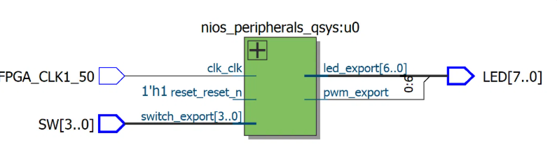

# Nios II SoC with a custom Avalon-MM PWM controller

Construire un processeur sur mesure dans le FPGA d'une DE10-Nano, puis lui ajouter un périphérique que je conçois moi-même: un contrôleur PWM en VHDL et je l'ai habillé d'une interface Avalon-MM esclave pour le brancher sur le même bus que les autres périphériques.

L'intérêt du projet n'est donc pas la LED qui s'allume. C'est le chemin complet entre une ligne de C et un signal physique.

## Le système

Un Nios II/e, 
4 Ko de mémoire on-chip, 
un JTAG UART, 
deux PIO pour les LED et les switches, 
et le contrôleur PWM. 
Tout est relié par l'interconnexion Avalon-MM générée par Platform Designer.

Les sorties exportées sont découpées dans le top-level : `LED[6:0]` viennent du PIO, `LED[7]` vient du PWM.



| Composant | Base | Taille |
|---|---|---|
| ram | 0x1000 | 4 Ko |
| nios.jtag_debug | 0x2800 | 2 Ko |
| switch | 0x3000 | 16 o |
| led | 0x3010 | 16 o |
| pwm | 0x3020 | 8 o |
| uart | 0x3028 | 8 o |

## Le PWM

Deux registres 32 bits, accessibles en lecture et en écriture.

| Offset | Registre | Rôle |
|---|---|---|
| 0x0 | period | Valeur de rechargement du compteur |
| 0x4 | duty | Seuil de basculement de la sortie |

Un compteur monte jusqu'à `period` puis reboucle. La sortie vaut 1 tant que le compteur est sous `duty`.

```
f_pwm = 50 MHz / period
rapport cyclique = duty / period
```

Avec `period = 50000`, le signal fait 1 kHz, bien au-dessus de la persistance rétinienne.

Le composant expose une interface Avalon-MM esclave classique : `address`, `chipselect`, `read`, `write`, `readdata`, `writedata`. Le `readdata` étant registré, l'interface est déclarée avec `Read wait = 1`.

## Pourquoi en matériel

Générer un PWM en logiciel obligerait le processeur à basculer une broche des milliers de fois par seconde, en boucle, pour toujours. Le timing se dégraderait à la première interruption.

Ici le CPU écrit une valeur une fois. Le circuit s'en occupe ensuite indéfiniment, sans consommer un cycle. C'est le partage classique : le logiciel configure, le matériel exécute.

## Ressources

Cyclone V 5CSEBA6U23I7, Quartus II 13.1 Web Edition.

| | |
|---|---|
| ALM | 839 / 41 910 (2 %) |
| Registres | 1 132 |
| Mémoire | 44 032 / 5 662 720 bits (< 1 %) |
| Broches | 13 / 314 |
| DSP | 0 / 112 |

## Contenu

```
pwm_avalon.vhd              le controleur
pwm_avalon_hw.tcl           la description pour Platform Designer
nios_peripherals.vhd        top-level
nios_peripherals_qsys.qsys  le systeme
nios_peripherals.qpf        projet Quartus
nios_peripherals.qsf        affectation des broches
hello_world_small.c                      application Nios
rtl_view.png
flow_summary.png
```

## Reproduire

1. Ouvrir `nios_peripherals.qpf` dans Quartus 13.1 ou plus récent
2. Générer le système dans Platform Designer, en VHDL pour la synthèse
3. Importer `DE10_Nano_Default.qsf` pour l'affectation des broches
4. Compiler
5. Dans Nios II SBT, créer une application depuis `nios_peripherals_qsys.sopcinfo`, template Hello World Small
6. Remplacer le source par `main.c` et construire

Les switches pilotent les 7 premières LED en tout ou rien, et la luminosité de la huitième sur 16 niveaux.
